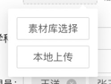

# 实现一个可以在点击处弹出的popup组件的功能

> 基于业务需要，需要自己实现一个在鼠标点击处弹出一个popup组件然后点击选择上传方式并弹出弹窗进行操作的功能

## 业务要求

需要在B端(React框架)和C端（Vue框架）实现一个功能相同的上传组件，该上传组件具备以下功能：

- 点击指定区域（通常是上传按钮）时，弹出一个如图的popup弹窗，供用户选择上传方式
  <br/>   
     
  <br/>
- 点击"素材库选择"时，打开一个网盘选择窗口，在其中选择某个符合业务要求的文件，并将文件信息返回给业务系统
- 点击"本地上传"时，先打开文件选择窗口，选择本地文件上传，并在上传完成之后选择是否要同步到素材库中，如果是单个图片就进行尺寸裁切（裁切比例按照业务系统传入的参数确定），裁切后进行上传再选择是否要同步到素材库
- 需要框架不同的两个端均可以实现相同功能，样式和逻辑完全一致

## 思考

在该功能之前，已经因为之前的需求实现了在指定容器中渲染一个网盘文件管理器（带有查看、上传、编辑、删除文件或文件夹功能）的react为基础的sdk，因此该次应考虑在该sdk基础上添加新的方法来实现该功能，同时这样也能保证多端的统一性和后续维护的简便性

## 实践

### 1、实现将react项目打入一个sdk中供人引用

该部分之前已经实现过，具体方式为将一个React项目的初始化部分作成一个构造器函数， 并在webpack打包配置中将该函数作为入口打包到单一文件中，页面通过载入该文件（可以通过js引入或npm的import方式），
将构造器函数挂载到window对象上，在需要使用时将容器元素和其他sdk内部要求的参数作为新建实例的参数实例化， 实例化过程中会自动将该React项目初始化在指定的容器上

入口文件例：

```jsx
 class SDKName {
  constructor(options) {
    this.options = options
    // ... 业务操作
    this._init()
  }

  _init() {
    // ...业务操作
    this.options.container && this._initDom()
  }

  _initDom() {
    // ... 业务操作
    ReactDOM.render(<App {...this.options} />, this.container) // app组件是React组件
  }

  unmount() {
    this.options.container && ReactDOM.unmountComponentAtNode(this.options.container)
  }
}

export default SDKName
```

webpack配置文件例：

```javascript

const options = {
  entry: {
    SDKName: './src/index.js'
  },
  output: {
    // ...其他配置
    filename: '[name].min.js',
    library: 'SDKName',
    libraryTarget: 'window',
    libraryExport: 'default',
  }
  // ... 其他常规配置
}

```

这样便能实现打包时生成一个SDKName.min.js的文件，并且该文件载入之后会将SDKName这个class类挂载到window对象上，以供调用

使用例：

```html

<script src="https://someWebSite.com/SDKName.min.js"></script>
<div id="root"></div>
<script>
  const sdk = new SDKName({
    container: document.querySelector('#root')
    // ...其他参数
  })
</script>
```

### 2、实现点击特定元素弹出由SDK控制的弹出菜单

实现思路：应当向SDK对象上挂载两个方法，一个可以在指定的容器*里渲染弹出菜单，一个可以由外部主动删除渲染的菜单

*指定的容器主要是针对弹出菜单后页面会有上下滚动的需求而设定（参考了ant-design的设计），实际上渲染的菜单的页面相对位置是由传入组件的点击事件event的点击位置决定的

挂载渲染和卸载菜单方法：

```javascript
class SDKName {
  
  // ...其他属性和方法

  /**
   * @description 销毁已经渲染的选择上传方式
   */
  unmountSelection() {
    if (this.uploadSelectorContainer) {
      ReactDOM.unmountComponentAtNode(this.uploadSelectorContainer)
      this.uploadSelectorContainer.parentNode.removeChild(this.uploadSelectorContainer)
      this.uploadSelectorContainer = null
    }
  }
  
  /**
   * @description 展示上传选择框，目前有两个选项：从本地选择上传、从素材库选择
   * @param {string[]} types: 支持的上传类型
   * @param {MouseEvent} event: 鼠标点击事件，用于定位弹出框
   * @param {() => HTMLElement} getPopupContainer: 获得滚动用的参考容器
   * @return {{unmount: function, eventEmitter: Subject}} 返回unmount方法和eventEmitter事件触发器
   */
  showUploadSelection({types, event, getPopupContainer}) {
    console.log('=============参数：', types, event, getPopupContainer)
    if (event.target) {
      // 判断是否是在已经渲染的菜单内进行二次点击
      
      if (isClickSelf(event)) {
        console.log('=============点击在组件内，不处理', event)
        return null
      }
    }
    
    // 渲染之前先卸载之前渲染的菜单
    this.unmountSelection()

    const newUploadSelectorContainer = document.createElement('div')
    
    // 使用预定的字符串作为容器元素的id
    newUploadSelectorContainer.id = SELECTOR_CONTAINER_ID

    // 如果不传入getPopupContainer就选择document.body作为容器插入的父节点
    const parent = getPopupContainer ? getPopupContainer() : document.body
    
    parent.appendChild(newUploadSelectorContainer)

    // 在容器上渲染菜单组件
    ReactDOM.render(<UploadSelector event={event} types={types} container={parent}/>, newUploadSelectorContainer)

    // 将容器节点保存在sdk内
    this.uploadSelectorContainer = newUploadSelectorContainer
    
    return {unmount: this.unmountSelection, eventEmitter: uploadSelectionSubject}
  }
}
```

这样就可以实现在任意html节点上挂载和销毁我们的弹出菜单，但是弹出菜单的位置应当是点击事件的位置，所以UploadSelector组件内部需要对event做处理

```jsx

import React, {useEffect, useState} from 'react'

import {Button, Modal} from 'antd'
import s from './index.module.less'

const selectionIdealHeight = 96
const selectionIdealWidth = 126

const UploadSelector = ({container, event, types}) => {

  const [style, setStyle] = useState({})

  const [selectorVisible, setSelectorVisible] = useState(false)
  
  useEffect(() => {
    
    // 获取渲染容器的文档内位置
    const rect = container.getBoundingClientRect()

    // 计算event点击和rect之间的相位置，并且将容器的style中的left和top值计算出来
    let left = Math.max(0, event.clientX - rect.x)
    let top = Math.max(0, event.clientY - rect.y)

    // 获得window的宽高
    
    const windowHeight = window.innerHeight

    const windowWidth = window.innerWidth

    // 判断菜单向左展开还是向右展开
    if (windowHeight - event.clientY < selectionIdealHeight) {
      top -= selectionIdealHeight
    }

    // 判断菜单向下展开还是向上展开
    if (windowWidth - event.clientX < selectionIdealWidth) {
      left -= selectionIdealWidth
    }

    setStyle({
      left,
      top
    })
  }, [event, container])

  const showMaterial = () => {
    // ... 填写逻辑展示素材库
  }
  
  const uploadBySelf = e => {
    // 将事件传出给用户，由用户自己进行上传操作
    uploadSelectionSubject.next({
      event: UPLOAD_EVENTS.UPLOAD_BY_SELF
    })
  }

  return <div className={s.selectorWrapper} style={style}>
    <div className={s.btnWrapper}>
      <Button onClick={showMaterial} className={s.btn}>素材库选择</Button>
    </div>
    <div className={s.btnWrapper}>
      <Button onClick={uploadBySelf} className={s.btn}>本地上传</Button>
    </div>
  </div>
}

export default UploadSelector
```

当event或container参数变化时，计算渲染的具体位置并改变容器元素selectorWrapper的style，selectorWrapper的css中的position属性是absolute，所以对应的left和top应该是相对于传入的容器的位置
